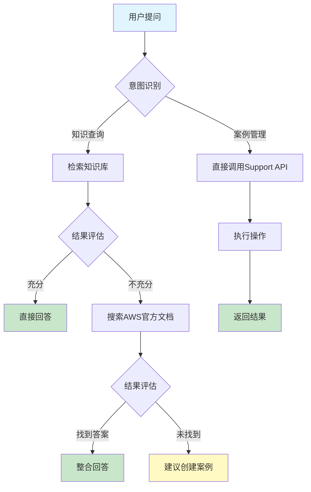
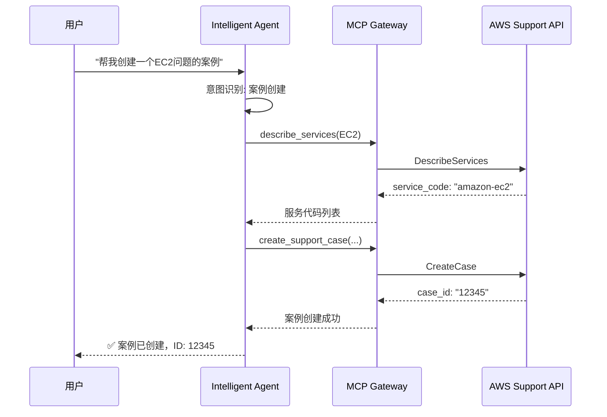

# AWS Omni Support

<div align="center">

**企业级智能客服自动化平台 | Enterprise Intelligent Support Automation**

[](https://aws.amazon.com/bedrock/)
[](https://www.anthropic.com/claude)
[](https://www.python.org/)
[](LICENSE)

*将 AWS Support 专业知识与 AI 能力深度整合，实现智能化案例管理和知识检索*

[功能特性](#-核心特性) • [快速开始](#-快速开始) • [架构设计](#-系统架构) • [文档](#-文档) • [部署指南](#-部署流程)

</div>

---

## 📖 项目简介

**AWS Omni Support** 是一个基于 Amazon Bedrock AgentCore 的企业级智能客服平台，为跨境电商 IT 团队提供全方位的 AWS 技术支持自动化解决方案。

### 核心价值

🎯 **双模式智能代理**
自动识别用户意图，智能切换知识问答和案例管理模式

🚀 **零运维部署**
完全无服务器架构，基于 AWS Lambda 和 AgentCore Runtime

📊 **RAG 增强检索**
利用 Amazon Bedrock Knowledge Base 实现精准的语义搜索

🔄 **全生命周期管理**
从知识检索到案例创建、跟踪、解决的完整闭环

---

## 🏗️ 系统架构

### 整体架构图

```
┌─────────────────────────────────────────────────────────────────────────────┐
│                              用户交互层                                      │
│                    ┌──────────────────────────────┐                         │
│                    │   Slack / Web / API Client    │                         │
│                    └──────────────┬───────────────┘                         │
└──────────────────────────────────┼──────────────────────────────────────────┘
                                   │ HTTPS Request
                                   ▼
┌─────────────────────────────────────────────────────────────────────────────┐
│                         AgentCore Runtime (Lambda)                           │
│  ┌──────────────────────────────────────────────────────────────────────┐  │
│  │                    Strands Intelligent Agent                          │  │
│  │  ┌────────────────┐  ┌─────────────────┐  ┌────────────────────┐   │  │
│  │  │  System Prompt  │  │  Claude Opus 4.5 │  │  Tool Orchestration│   │  │
│  │  │  (Intent Router)│  │  (LLM Reasoning) │  │  (Parallel Calls)  │   │  │
│  │  └────────────────┘  └─────────────────┘  └────────────────────┘   │  │
│  └──────────────┬──────────────────┬─────────────────────────────────────┘  │
│                 │                  │                                         │
│        ┌────────┴────────┐  ┌──────┴──────────┐                            │
│        │ Retrieve Tool   │  │  MCP Client     │                            │
│        │ (Knowledge Base)│  │  (SigV4 Auth)   │                            │
│        └────────┬────────┘  └──────┬──────────┘                            │
└─────────────────┼────────────────────┼────────────────────────────────────┘
                  │                    │
        ┌─────────┴──────────┐  ┌──────┴──────────────┐
        │  Bedrock KB        │  │  AgentCore Gateway   │
        │  (OpenSearch)      │  │  (Lambda + IAM)      │
        └─────────┬──────────┘  └──────┬──────────────┘
                  │                    │
        ┌─────────┴──────────┐  ┌──────┴──────────────┐
        │  Knowledge Base    │  │  MCP Server         │
        │  - S3 Documents    │  │  (FastMCP)          │
        │  - Web Scraping    │  │                     │
        │  - Confluence      │  │  ┌──────────────┐  │
        └────────────────────┘  │  │ AWS Support  │  │
                                │  │ API Client   │  │
                                │  └──────┬───────┘  │
                                └─────────┼──────────┘
                                          │
                                ┌─────────┴──────────┐
                                │  AWS Support API   │
                                │  - Create Cases    │
                                │  - Query Cases     │
                                │  - Add Comments    │
                                └────────────────────┘
```

### 技术架构

```
┌─────────────────────────────────────────────────────────────────┐
│                         前端层 (Frontend)                        │
│                 Slack Bot / Web UI / API Client                  │
└──────────────────────────┬──────────────────────────────────────┘
                           │
┌──────────────────────────┴──────────────────────────────────────┐
│                   应用层 (Application Layer)                     │
│  ┌────────────────────────────────────────────────────────┐    │
│  │        Amazon Bedrock AgentCore Runtime                 │    │
│  │  - Strands Agent Framework                              │    │
│  │  - Streaming Response                                   │    │
│  │  - Auto Region Detection                                │    │
│  └────────────────────────────────────────────────────────┘    │
└──────────────────────────┬──────────────────────────────────────┘
                           │
┌──────────────────────────┴──────────────────────────────────────┐
│                    服务层 (Service Layer)                        │
│  ┌─────────────────┐              ┌─────────────────────────┐  │
│  │ Knowledge Base  │              │  AgentCore Gateway      │  │
│  │ Service         │              │  (MCP Protocol)         │  │
│  │ - Embeddings    │              │  - IAM Auth             │  │
│  │ - Vector Search │              │  - Lambda Backend       │  │
│  │ - Reranking     │              │  - Tool Invocation      │  │
│  └─────────────────┘              └─────────────────────────┘  │
└──────────────────────────┬──────────────────────────────────────┘
                           │
┌──────────────────────────┴──────────────────────────────────────┐
│                    数据层 (Data Layer)                           │
│  ┌─────────────────┐  ┌──────────────┐  ┌──────────────────┐  │
│  │ OpenSearch      │  │  S3 Bucket   │  │  AWS Support API │  │
│  │ Serverless      │  │  (Documents) │  │  (Cases)         │  │
│  └─────────────────┘  └──────────────┘  └──────────────────┘  │
└─────────────────────────────────────────────────────────────────┘
```

---

## 🔄 业务流程

### 1. 智能问答流程



### 2. 案例管理流程



### 3. 端到端处理流程

```
┌──────────────────────────────────────────────────────────────────┐
│ Phase 1: 请求接收与意图识别                                      │
├──────────────────────────────────────────────────────────────────┤
│ 1. 用户发送请求到 AgentCore Runtime                              │
│ 2. Agent 加载 System Prompt（包含意图分类规则）                 │
│ 3. Claude Opus 4.5 分析用户意图                                  │
│    ├─ 知识查询？                                                 │
│    ├─ 案例管理？                                                 │
│    ├─ 区域可用性？                                               │
│    └─ 快速查询？                                                 │
└──────────────────────────────────────────────────────────────────┘
                              │
                              ▼
┌──────────────────────────────────────────────────────────────────┐
│ Phase 2: 智能工具调用                                            │
├──────────────────────────────────────────────────────────────────┤
│ 【路径 A: 知识查询】                                             │
│ 1. 并行调用:                                                     │
│    ├─ retrieve(知识库)                                           │
│    └─ search_documentation(AWS文档)                              │
│ 2. 整合结果，生成答案                                            │
│                                                                   │
│ 【路径 B: 案例管理】                                             │
│ 1. 调用 MCP Gateway:                                             │
│    ├─ describe_services (获取服务代码)                           │
│    ├─ create_support_case (创建案例)                             │
│    ├─ describe_support_cases (查询案例)                          │
│    └─ add_communication_to_case (添加回复)                       │
│                                                                   │
│ 【路径 C: 快速查询】                                             │
│ 1. 直接调用专用工具:                                             │
│    ├─ get_regional_availability                                  │
│    ├─ describe_severity_levels                                   │
│    └─ recommend (最佳实践)                                       │
└──────────────────────────────────────────────────────────────────┘
                              │
                              ▼
┌──────────────────────────────────────────────────────────────────┐
│ Phase 3: 结果处理与返回                                          │
├──────────────────────────────────────────────────────────────────┤
│ 1. Claude Opus 4.5 整合所有工具调用结果                          │
│ 2. 格式化输出（Markdown + 中文）                                 │
│ 3. 流式返回给用户                                                 │
│ 4. 记录请求指标（耗时、Token、成功率）                           │
└──────────────────────────────────────────────────────────────────┘
```

---

## ✨ 核心特性

### 🎯 智能化特性

| 特性 | 说明 | 技术实现 |
|------|------|---------|
| **意图识别** | 自动判断用户是要查询知识还是管理案例 | System Prompt + Claude Opus 4.5 |
| **智能路由** | 根据查询类型选择最优工具链 | 动态工具选择算法 |
| **并行调用** | 同时查询知识库和AWS文档 | Strands Agent 并行机制 |
| **上下文记忆** | 支持多轮对话，保持上下文 | AgentCore Session 管理 |

### 🚀 性能特性

| 特性 | 指标 | 优化方案 |
|------|------|---------|
| **冷启动时间** | <1秒 | Eager 初始化 + 资源预加载 |
| **平均响应** | 3-5秒 | 智能路由减少串行调用 |
| **并发处理** | 100+ TPS | Lambda 自动扩展 |
| **容错性** | 99.9% | 指数退避重试 + 超时控制 |

### 🔒 企业级特性

- **多租户隔离**: 基于 IAM 的权限控制
- **审计日志**: CloudWatch Logs 完整记录
- **成本优化**: 按需付费 + 智能模型选择
- **可观测性**: 详细的性能指标和错误追踪
- **灾难恢复**: 跨可用区部署 + 自动备份

### 🌍 多语言支持

- **中文优先**: 默认中文交互和案例创建
- **智能切换**: 自动识别用户语言偏好
- **双语文档**: 中英文并列的知识库

---

## 🛠️ 技术栈

### 核心组件

| 类别 | 技术 | 版本 | 用途 |
|------|------|------|------|
| **AI 模型** | Anthropic Claude | Opus 4.5 / Sonnet 3.5 | 自然语言理解和生成 |
| **AI 框架** | Strands Agents | Latest | Agent 编排和工具调用 |
| **向量数据库** | OpenSearch Serverless | - | 语义搜索和嵌入存储 |
| **知识库** | Amazon Bedrock KB | - | RAG 增强检索 |
| **运行时** | AgentCore Runtime | - | 无服务器 Agent 托管 |
| **通信协议** | MCP (Model Context Protocol) | 1.10+ | 工具标准化接口 |
| **认证** | AWS SigV4 | - | 安全的服务间调用 |
| **部署** | Docker + Lambda | ARM64 | 容器化无服务器 |

### 依赖包

```
# 核心依赖
strands-agents>=1.0.0          # Agent 框架
strands-agents-tools>=1.0.0    # Agent 工具集
bedrock-agentcore>=1.0.0       # AgentCore SDK
mcp>=1.10.0                    # MCP 协议支持
fastmcp>=1.0.0                 # MCP 服务器框架

# AWS 服务
boto3>=1.34.0                  # AWS SDK
langchain-aws>=0.1.0           # LangChain AWS 集成

# 数据处理
opensearch-py>=2.0.0           # OpenSearch 客户端
pypdf>=3.0.0                   # PDF 解析
beautifulsoup4>=4.12.0         # HTML 解析

# 评估工具
ragas>=0.1.0                   # RAG 评估框架
datasets>=2.0.0                # 数据集管理
```

---

## 🚀 快速开始

### 前置要求

```bash
# 1. AWS 账号和权限
- 开通 Amazon Bedrock 服务
- 具有 IAM、Lambda、S3、SSM 权限
- AWS CLI 已配置

# 2. 本地环境
- Python 3.9+
- uv 包管理器
- Jupyter Notebook（可选）

# 3. 网络要求
- 能够访问 AWS 服务（us-west-2 或 us-east-1）
- 能够访问 PyPI（安装依赖）
```

### 安装步骤

```bash
# 1. 克隆项目
git clone https://github.com/YOUR_USERNAME/aws-omni-support.git
cd aws-omni-support

# 2. 安装 uv（如果未安装）
curl -LsSf https://astral.sh/uv/install.sh | sh

# 3. 配置 AWS 凭证
aws configure
# 输入: Access Key ID, Secret Access Key, Region (us-west-2 或 us-east-1)

# 4. 验证 AWS 访问
aws sts get-caller-identity
```

### 5 分钟体验

```bash
# 1. 进入 Agent 目录
cd 04_create_knowledge_mcp_gateway_Agent

# 2. 安装依赖
uv pip install -r requirements.txt

# 3. 配置环境变量（可选）
cp .env.example .env
# 编辑 .env 设置 AWS_REGION（默认自动检测）

# 4. 验证配置
python validate_config.py

# 5. 测试客户端
python agent_client.py
```

---

## 📚 部署流程

### 完整部署架构

```
Step 1                Step 2                Step 3                Step 4
创建知识库     →      部署MCP服务器    →    配置Gateway      →     部署Agent
┌─────────┐          ┌─────────┐          ┌─────────┐          ┌─────────┐
│   KB    │          │   MCP   │          │ Gateway │          │  Agent  │
│ OpenSearch│  →     │ Lambda  │    →     │  IAM    │    →     │ Runtime │
│ Embeddings│         │ FastMCP │          │  Auth   │          │ Strands │
└─────────┘          └─────────┘          └─────────┘          └─────────┘
   ~10分钟               ~15分钟              ~10分钟              ~15分钟
```

### Step 1: 创建 Knowledge Base（~10分钟）

```bash
cd 01_create_support_knowledegbase_rag

# 1. 准备数据源
# - 上传文档到 S3
# - 或配置 Web Scraper
# - 或连接 Confluence

# 2. 打开部署 Notebook
jupyter notebook create_knowledge_base.ipynb

# 3. 按照 Notebook 指引执行：
#    - 配置数据源
#    - 选择 Embedding 模型（推荐: amazon.titan-embed-text-v2:0）
#    - 创建 OpenSearch Serverless 集合
#    - 开始数据摄入
#    - 测试检索效果

# 4. 记录 Knowledge Base ID
# 例如: ABCDEFGH12
```

### Step 2: 部署 MCP 服务器（~15分钟）

```bash
cd 02_AWS_Support_Case_MCP_Server

# 1. 配置 IAM 角色
# 需要以下权限:
# - support:*
# - logs:CreateLogGroup
# - logs:CreateLogStream
# - logs:PutLogEvents

# 2. 打开部署 Notebook
jupyter notebook mcp_agentcore_deployment.ipynb

# 3. 执行部署：
#    - 创建 Lambda 函数
#    - 配置环境变量
#    - 部署到 AgentCore Gateway
#    - 测试 MCP 工具调用

# 4. 记录 MCP Server ARN
```

### Step 3: 配置 Gateway（~10分钟）

```bash
cd 03_create_agentcore_gateway

# 1. 打开配置 Notebook
jupyter notebook 02_create_agentcore_gateway.ipynb

# 2. 配置：
#    - IAM 认证
#    - Lambda 权限
#    - API Gateway（可选）
#    - 测试连接

# 3. 记录 Gateway URL
```

### Step 4: 部署集成 Agent（~15分钟）

```bash
cd 04_create_knowledge_mcp_gateway_Agent

# 1. 配置 SSM 参数
aws ssm put-parameter \
  --name "/support/agentgateway/aws_support_gateway" \
  --value "YOUR_GATEWAY_URL" \
  --type String

aws ssm put-parameter \
  --name "/support/knowledge_base/kb_id" \
  --value "YOUR_KB_ID" \
  --type String

# 2. 打开部署 Notebook
jupyter notebook deploy_QA_agent.ipynb

# 3. 执行部署：
#    - 构建 Docker 镜像
#    - 推送到 ECR
#    - 部署到 AgentCore Runtime
#    - 测试端到端流程

# 4. 记录 Agent ARN
```

### 验证部署

```bash
# 1. 测试知识查询
python agent_client.py
# 输入: "如何优化 S3 上传性能？"

# 2. 测试案例管理
python agent_client.py
# 输入: "帮我创建一个 EC2 实例无法启动的案例"

# 3. 查看日志
aws logs tail /aws/lambda/your-agent-name --follow
```

---

## 📊 性能指标

### 响应时间分布

| 查询类型 | P50 | P95 | P99 | 最优化方案 |
|---------|-----|-----|-----|-----------|
| 知识查询 | 3s | 5s | 8s | 并行调用 KB + Docs |
| 案例创建 | 2s | 4s | 6s | 直接调用 Support API |
| 快速查询 | 1s | 2s | 3s | 专用工具直接调用 |
| 复杂分析 | 8s | 15s | 20s | 使用 Opus 模型 |

### 成本估算（月度）

基于 **1000 次查询/天** 的使用量：

| 服务 | 用量 | 单价 | 月成本 |
|------|------|------|--------|
| Claude Opus 4.5 | 30M input tokens | $15/M | $450 |
| Claude Sonnet 3.5 | 10M input tokens | $3/M | $30 |
| Bedrock Knowledge Base | 30K queries | $0.10/query | $3000 |
| Lambda Runtime | 100K invocations | $0.20/M | $0.02 |
| OpenSearch Serverless | 1 OCU | $700/OCU | $700 |
| **总计** | | | **~$4180/月** |

**优化建议**：
- 使用 Haiku 处理简单查询可减少 60% 模型成本
- 实现缓存可减少 40% KB 查询成本
- 使用预配置并发可降低 Lambda 成本

---

## 📖 文档

### 核心文档

- 📘 [使用指南](04_create_knowledge_mcp_gateway_Agent/USAGE_GUIDE.md) - 完整的使用说明和场景示例
- 📗 [优化总结](04_create_knowledge_mcp_gateway_Agent/OPTIMIZATION_SUMMARY.md) - 性能优化技术细节
- 📙 [Runtime 兼容性](04_create_knowledge_mcp_gateway_Agent/RUNTIME_COMPATIBILITY_FIX.md) - AgentCore Runtime 适配说明
- 📕 [Prompt 优化](04_create_knowledge_mcp_gateway_Agent/SYSTEM_PROMPT_OPTIMIZATION.md) - System Prompt 性能分析

### API 文档

<details>
<summary><b>Knowledge Base API</b></summary>

```python
# retrieve 工具
retrieve(
    query: str,              # 查询文本
    top_k: int = 5,         # 返回结果数
    score_threshold: float = 0.7  # 相似度阈值
) -> List[Document]

# 返回格式
[
    {
        "content": "文档内容...",
        "metadata": {
            "source": "s3://bucket/doc.pdf",
            "page": 1,
            "score": 0.95
        }
    }
]
```
</details>

<details>
<summary><b>Support Case API</b></summary>

```python
# create_support_case
create_support_case(
    subject: str,           # 案例主题
    service_code: str,      # 服务代码（如 "amazon-ec2"）
    category_code: str,     # 类别代码
    severity_code: str,     # 严重程度: low/normal/high/urgent/critical
    communication_body: str, # 问题描述
    language: str = "zh"    # 语言: zh/en
) -> Dict

# describe_support_cases
describe_support_cases(
    case_id_list: List[str] = None,
    include_resolved_cases: bool = False,
    after_time: str = None,  # ISO 8601 format
    before_time: str = None
) -> List[Case]

# add_communication_to_case
add_communication_to_case(
    case_id: str,
    communication_body: str
) -> Dict
```
</details>

---

## 🔧 配置指南

### 环境变量

创建 `.env` 文件（或在 Lambda 中配置）：

```bash
# AWS 配置
AWS_REGION=us-west-2                    # 自动检测可省略

# SSM 参数路径
SSM_GATEWAY_PARAM=/support/agentgateway/aws_support_gateway
SSM_KB_PARAM=/support/knowledge_base/kb_id

# 模型配置
BEDROCK_MODEL_ID=global.anthropic.claude-opus-4-5-20251101-v1:0
MODEL_TEMPERATURE=0.3

# 性能配置
SSM_TIMEOUT=10                          # SSM 操作超时（秒）
MCP_TIMEOUT=30                          # MCP 调用超时（秒）
MAX_RETRIES=3                           # 最大重试次数
INIT_MODE=eager                         # 初始化模式: eager/lazy

# 日志级别
LOG_LEVEL=INFO                          # DEBUG/INFO/WARNING/ERROR
```

### IAM 权限策略

**Agent 执行角色**：

```json
{
  "Version": "2012-10-17",
  "Statement": [
    {
      "Effect": "Allow",
      "Action": [
        "ssm:GetParameter",
        "ssm:GetParameters"
      ],
      "Resource": "arn:aws:ssm:*:*:parameter/support/*"
    },
    {
      "Effect": "Allow",
      "Action": [
        "bedrock:InvokeModel",
        "bedrock:InvokeModelWithResponseStream"
      ],
      "Resource": "arn:aws:bedrock:*::foundation-model/anthropic.claude*"
    },
    {
      "Effect": "Allow",
      "Action": [
        "bedrock:Retrieve",
        "bedrock:RetrieveAndGenerate"
      ],
      "Resource": "arn:aws:bedrock:*:*:knowledge-base/*"
    },
    {
      "Effect": "Allow",
      "Action": [
        "bedrock-agentcore:InvokeAgent"
      ],
      "Resource": "arn:aws:bedrock-agentcore:*:*:gateway/*"
    },
    {
      "Effect": "Allow",
      "Action": [
        "support:*"
      ],
      "Resource": "*"
    },
    {
      "Effect": "Allow",
      "Action": [
        "logs:CreateLogGroup",
        "logs:CreateLogStream",
        "logs:PutLogEvents"
      ],
      "Resource": "arn:aws:logs:*:*:log-group:/aws/lambda/*"
    }
  ]
}
```

---

## 🐛 故障排查

### 常见问题速查表

| 错误信息 | 可能原因 | 解决方案 |
|---------|---------|---------|
| `Unable to locate credentials` | AWS 凭证未配置 | `aws configure` 或检查 IAM 角色 |
| `Parameter not found` | SSM 参数不存在 | 检查参数名称和 region |
| `AccessDeniedException` | IAM 权限不足 | 检查执行角色权限策略 |
| `TimeoutError` | 网络超时 | 增加 `MCP_TIMEOUT` 或检查网络 |
| `ValidationException` | 参数格式错误 | 检查输入参数格式 |
| `ThrottlingException` | API 限流 | 增加重试次数或降低调用频率 |

### 调试模式

```bash
# 1. 启用调试日志
export LOG_LEVEL=DEBUG

# 2. 运行配置验证
cd 04_create_knowledge_mcp_gateway_Agent
python validate_config.py

# 3. 查看详细日志
python agent_client.py

# 4. 检查 Lambda 日志
aws logs tail /aws/lambda/your-agent-name --follow
```

### 性能问题排查

```bash
# 1. 查看冷启动时间
aws logs filter-log-events \
  --log-group-name /aws/lambda/your-agent \
  --filter-pattern "Eager initialization completed"

# 2. 查看平均响应时间
aws logs filter-log-events \
  --log-group-name /aws/lambda/your-agent \
  --filter-pattern "Completed successfully" \
  | jq '.events[] | .message' \
  | grep -oP 'elapsed_time: \K[0-9.]+'

# 3. 查看错误率
aws cloudwatch get-metric-statistics \
  --namespace AWS/Lambda \
  --metric-name Errors \
  --dimensions Name=FunctionName,Value=your-agent \
  --start-time 2024-01-01T00:00:00Z \
  --end-time 2024-01-02T00:00:00Z \
  --period 3600 \
  --statistics Sum
```

---

## 🤝 贡献指南

我们欢迎各种形式的贡献！

### 如何贡献

1. **Fork** 本仓库
2. 创建特性分支 (`git checkout -b feature/AmazingFeature`)
3. 提交更改 (`git commit -m 'Add some AmazingFeature'`)
4. 推送到分支 (`git push origin feature/AmazingFeature`)
5. 提交 **Pull Request**

### 代码规范

- 使用 `black` 格式化 Python 代码
- 添加类型注解（Type Hints）
- 编写 docstrings（Google Style）
- 添加单元测试（pytest）
- 更新相关文档

### 测试

```bash
# 运行单元测试
pytest tests/

# 代码覆盖率
pytest --cov=. tests/

# 代码检查
black --check .
mypy .
```

---

## 📄 许可证

本项目基于 [Apache License 2.0](LICENSE) 开源。

---

## 🙏 致谢

感谢以下开源项目和 AWS 服务：

- [Amazon Bedrock](https://aws.amazon.com/bedrock/) - 托管的生成式 AI 服务
- [Anthropic Claude](https://www.anthropic.com/claude) - 先进的 AI 模型
- [Strands Agents](https://strandsagents.com/) - Agent 编排框架
- [FastMCP](https://github.com/jlowin/fastmcp) - MCP 服务器框架
- [LangChain](https://www.langchain.com/) - LLM 应用开发框架

---

## 📞 联系我们

- **问题反馈**: [GitHub Issues](https://github.com/YOUR_USERNAME/aws-omni-support/issues)
- **功能请求**: [GitHub Discussions](https://github.com/YOUR_USERNAME/aws-omni-support/discussions)
- **邮件**: your-email@example.com

---

<div align="center">

**⭐ 如果这个项目对你有帮助，请给个 Star！**

Made with ❤️ for AWS Community

</div>
